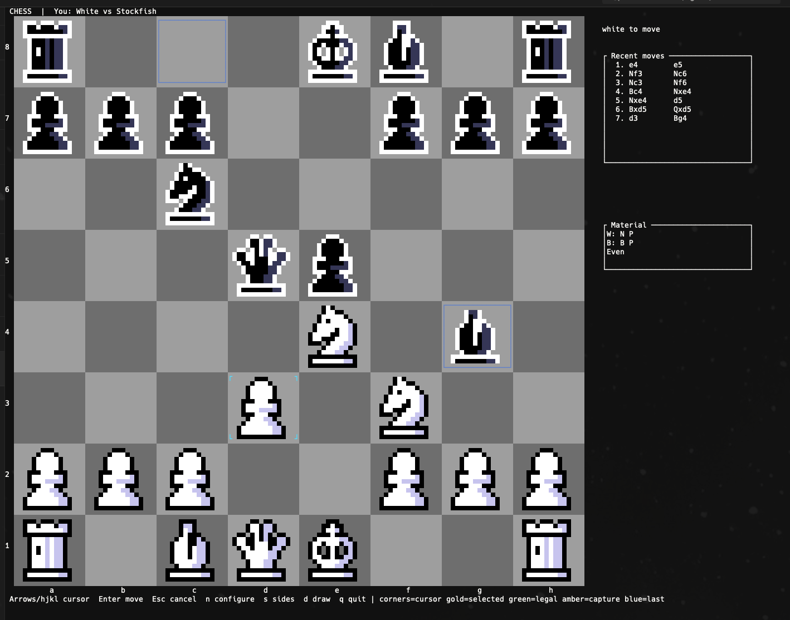

# Chess TUI

A keyboard-operated chess game built with Rust, Ratatui, Crossterm, and
Shakmaty, played as the human side against Stockfish. By default the human is
White and the engine Black; when no engine is available it falls back to a
local two-player game.

## Screenshot



The side panel keeps recent moves and captured material visible: `W:` and
`B:` list the pieces captured by each colour, followed by the current material
advantage.

## Run

Install a current stable Rust toolchain, then run from this directory:

```sh
cargo run --locked
```

On macOS or Windows (x86-64 or arm64), the first run automatically fetches,
SHA-256-verifies, and stages the pinned Stockfish binary (roughly 80-105 MB,
one-time) before starting; later runs find the already-staged binary with no
network access. To pre-fetch on macOS (for example on a machine without
network access at launch time, or in CI), run `bash scripts/fetch-stockfish.sh`
yourself first; it uses the same pin (there is no Windows equivalent script,
since the automatic fetch already covers Windows at runtime). Set
`STOCKFISH_PATH` to override with a custom binary on any platform. On any
other platform there is no verified pin yet, so the app falls back straight
to a local two-player game.

Use a terminal with at least **170 columns and 68 rows**. Smaller windows show a
resize prompt with the current size and pause game input. Without an engine the
app runs a local two-player game and shows a notice.

## Controls

| Key | Action |
| --- | --- |
| Arrows or `hjkl` | Move the board cursor |
| Enter | Select your piece, then play at the cursor |
| Tab / Shift+Tab | Cycle forward / backward through legal destinations for the selected piece |
| Escape | Cancel selection or promotion |
| `q`, `r`, `b`, `n` during promotion | Choose queen, rook, bishop, or knight |
| `d` | Claim a draw if eligible (also works while choosing promotion) |
| `n` | Open new-game configuration (during promotion, chooses a knight) |
| Left/right in configuration | Choose White, Black, or random side |
| Up/down in configuration | Adjust Stockfish Skill Level (0 weakest, 20 strongest) |
| Enter / Escape in configuration | Start / cancel |
| `s` | Toggle which colour the human plays and restart immediately |
| `q` | Quit (outside promotion) |
| Ctrl+C | Quit at any time |

While the engine is thinking, move input is blocked but cursor movement, quit,
new-game configuration and side-switch stay available; the side panel shows the engine's
thinking or error state.

The board is painted with native Ratatui cells from the exact
[Pixel Chess Pieces](https://spicygame.itch.io/chess-pieces) CC0 sprites by
SpicyGame (16x16, Creative Commons Zero v1.0). Every sprite pixel is drawn
directly as a half-block terminal cell (`▀` with foreground = the top pixel and
background = the bottom pixel), with no resampling, approximation, or image
protocol: each pixel keeps its exact colour, transparent pixels keep the square
colour, and integer scaling is used only if a size variant is enabled. This
renders identically in every terminal, including WarpTerminal. The white army
uses the pack's white sprites and the black army its black sprites. The
selected square is framed by a high-contrast gold box-drawing outline (its
interior keeps the exact sprite pixels), a cursor without a selection is marked
with bright cyan three-cell corner brackets, empty legal destinations get a small
centred green marker (no more than a quarter of the square, with the base
colour visible around it), capturable destinations get a thin red-orange
outline, last-move squares get a subtle blue outline, and a king in check gets
a clear red outline. The human side is
always shown at the bottom when playing Stockfish.

**Size tradeoff.** A 16x16 sprite maps to a 16-column by 8-row cell block (one
pixel per cell width, two pixel rows per half-block cell), so the 8x8 board
needs 128 columns and 64 rows of cells, plus coordinates and the side panel:
minimum terminal 170x68. A 2x integer downscale of the sprites would halve that
to about 85x40 but drops half the sprite detail; a 2x integer upscale would
double it to roughly 330x140. Native 1x is the best fidelity-to-size balance
for pixel-exact rendering.

To castle, select the king and its destination (`g1`, `c1`, `g8`, or `c8`).
The side panel shows the most recent moves in standard algebraic notation.

## Assets

The 12 standard sprites are vendored in `assets/sprites/` and decoded ahead of
time into exact static RGBA pixel data in `src/sprites.rs` (generated by
`tools/generate_sprites.py`), so the binary needs no runtime image decoding or
image dependency. Source, license, download method, and per-file SHA-256
checksums are recorded in [`assets/PROVENANCE.md`](assets/PROVENANCE.md); a
test verifies the static pixel data matches the vendored PNGs byte for byte.

## Stockfish

Engine lookup order: `STOCKFISH_PATH` (environment override), then an
executable-sibling `stockfish` (`stockfish.exe` on Windows) for packaged
builds, then the staged source-tree binary under
`third_party/stockfish/bundle/` for cargo/source runs. `PATH` is never
consulted. Engine moves are validated for legality before they are played.

If none of those is found and the platform has a verified pin (macOS,
Windows x86-64, Windows arm64), `src/fetch.rs` fetches, SHA-256-verifies,
extracts, and stages the matching pinned Stockfish binary into that same
source-tree path before the lookup runs again — a plain `cargo run` plays
against the engine with no manual step. This is a Rust port of
`scripts/fetch-stockfish.sh`'s download/verify/stage logic (kept in sync with
`third_party/stockfish/manifest.json`, guarded by a test), so a packaged
binary doesn't depend on the shell script being present. Every pin shells out
to the same trusted system tools (`curl`, `tar`) for downloading and
extracting instead of adding new crate dependencies for that, and never
executes the binary as part of verifying it; hashing itself uses the `sha2`
crate directly rather than a platform tool, since `shasum` (macOS) and
`certutil`/PowerShell (Windows) would otherwise need separate, locale-
sensitive output parsing. `scripts/fetch-stockfish.sh` stays available for
pre-fetching on macOS (for example on a machine without network access at
launch time, or in CI); there is no Windows equivalent script, since the
automatic Rust fetch already gives Windows the same first-run convenience.

The binaries themselves are gitignored staging (`third_party/stockfish/bundle/`);
the pins, license and source pointer stay tracked under `third_party/stockfish/`.
No packaged release exists yet: a future distributable archive, `.app`, or
Windows installer must place the engine beside the executable and ship the
GPL files from that directory — auto-fetch only covers the cargo/source-tree
path, not that case.

On any platform without a verified pin, the app skips fetching entirely and
falls back to the existing local two-player notice.

## Rules

Shakmaty generates legal moves, including castling, en passant, and all four
promotion choices. The app reports check, checkmate, stalemate, and insufficient
material detected by Shakmaty. It ends the game automatically at fivefold
repetition or 75 moves by each side without a pawn move or capture. Checkmate
takes precedence over the 75-move draw.

Threefold repetition and the 50-move rule require a claim with `d`; play can
continue if nobody claims. To claim **before an intended move**, select its
piece, place the cursor on its legal destination, and press `d` instead of
Enter. The intended move is not played. Pressing `d` while the promotion
chooser is open claims from the current position or the pending promotion
move without choosing a piece. Position comparisons include the side
to move, castling rights, and legally available en passant captures.

This is a casual local board, not a tournament arbiter. It does not adjudicate
every possible dead position (for example, blocked positions where no sequence
can lead to mate), draw agreements, resignation, or tournament claim penalties.
There are no clocks or saved games in this version.

## Checks

```sh
cargo fmt --check
cargo test --locked
cargo clippy --locked --all-targets -- -D warnings
```

Tests cover keyboard selection, illegal moves, castling, en passant,
underpromotion, end states, draw thresholds and intended-move claims
including claims during promotion choice, repetition identity, the 170x72
layout and resize prompt, the vendored sprite checksums and 16x16 dimensions,
exact per-pixel half-block painting of the sprites, highlight preservation,
and the game/input/render module split.

Dependency documentation: [Ratatui](https://docs.rs/ratatui/0.30/ratatui/),
[Crossterm](https://docs.rs/crossterm/0.29/crossterm/), and
[Shakmaty](https://docs.rs/shakmaty/0.30/shakmaty/).

## License

This project is licensed under the **GNU General Public License v3.0 or
later** (GPL-3.0-or-later); see [`LICENSE`](LICENSE). Source files carry an
`SPDX-License-Identifier: GPL-3.0-or-later` header.

It depends on two other GPL-3.0 works, whose own license text is vendored
verbatim rather than only linked:

- **[Shakmaty](https://github.com/niklasf/shakmaty)** (GPL-3.0-or-later) —
  the move-generation and rules library this project links against for
  legal moves, castling, en passant, promotions, and game-end detection.
  License text: [`third_party/shakmaty/COPYING`](third_party/shakmaty/COPYING).
- **[Stockfish](https://stockfishchess.org/)** (GPL-3.0-only) — the chess
  engine run as a separate subprocess; see [Stockfish](#stockfish) above.
  License text: [`third_party/stockfish/Copying.txt`](third_party/stockfish/Copying.txt).

Because this project links `shakmaty`, a GPL-3.0-or-later library, the
resulting binary is a combined work and is licensed GPL-3.0-or-later as a
whole.

The board sprites are the **[Pixel Chess Pieces](https://spicygame.itch.io/chess-pieces)**
pack by [SpicyGame](https://spicygame.itch.io/), released under
[CC0 1.0 Universal](https://creativecommons.org/publicdomain/zero/1.0/). CC0
places no obligation on us, but we're glad to credit SpicyGame's work here
and in [`assets/PROVENANCE.md`](assets/PROVENANCE.md) all the same — thank
you for making it freely available.
